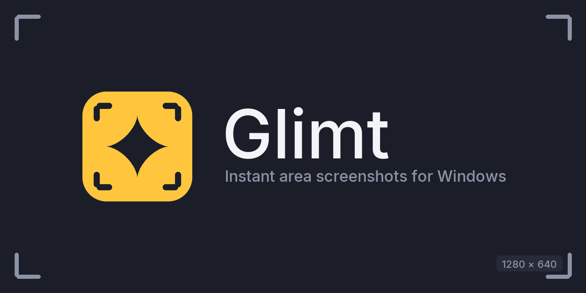

<p align="center">
  
</p>

<p align="center">
  <a href="https://github.com/Nicsilver/glimt/releases/latest"></a>
  <a href="https://github.com/Nicsilver/glimt/actions/workflows/ci.yml"></a>
  <a href="LICENSE"></a>
</p>

*Glimt* is Danish for a glint, a brief flash of light. That is the whole idea: press PrtSc and the screen has already frozen, on every monitor, before a normal screenshot tool would have finished waking up.

Drag to select, annotate if you want, then Ctrl+C puts the PNG on your clipboard or Ctrl+S drops it in your Pictures folder. No accounts, no cloud, no window in your way. One portable exe, written in pure Rust.

## Why Glimt

- **Instant.** The overlay is pre-rendered and waiting, so there is no lag between keypress and frozen screen. What you see is the exact frame you pressed on.
- **Precise.** A zoom loupe follows your cursor while you drag, a live badge shows the selection size, and you can nudge any edge by the pixel with the arrow keys.
- **Private.** Screenshots go to your clipboard or your disk. Nothing ever leaves your machine.
- **Small.** A single exe, no installer, no background updater, no Electron.

## Features

- Freezes all monitors at once, with correct per-monitor DPI scaling
- Pixel-precise selection: zoom loupe, size badge, resize handles, arrow-key nudge (Shift for 10 px)
- Annotations: pen, line, arrow, rectangle and text in five colors, with undo
- Ctrl+C copies to the clipboard, Ctrl+S saves to `Pictures\Glimt` with a timestamped name
- Records a region to MP4 or GIF: Shift+PrtSc or the toolbar's Video switch, and the saved file lands on your clipboard ready to paste
- Lives in the tray, optional start with Windows

## Install

Grab `glimt.exe` from the [latest release](https://github.com/Nicsilver/glimt/releases/latest) and run it. That's it: the icon appears in your tray and PrtSc is live. The exe is unsigned, so SmartScreen will warn once.

To start Glimt with Windows, toggle it in the tray menu.

## Shortcuts

| Key | Action |
| --- | --- |
| PrtSc | Freeze the screen and start selecting |
| Shift+PrtSc | Same, but in video mode |
| Drag | Select an area (with zoom loupe) |
| Arrow keys | Nudge the selection 1 px (Shift: 10 px) |
| Ctrl+C | Copy the selection to the clipboard |
| Ctrl+S | Save to `Pictures\Glimt` |
| Ctrl+Z | Undo last annotation |
| Enter | Start recording the selection (video mode) |
| Esc | Cancel |

While recording, a small pill next to the region shows the timer with Stop and Discard buttons; pressing PrtSc again also stops and saves.

If another tool already owns PrtSc (Lightshot, ShareX, OneDrive), close it or unbind its hotkey; capture from the tray menu works either way.

## Building

```
cargo build --release
```

The exe lands in `target\release\glimt.exe`. Icon, tray and banner assets are generated by `python tools/make_brand.py`.

## Releasing

Push a tag `v*` and GitHub Actions builds the exe and attaches it to a release.

## License

[AGPL-3.0](LICENSE)
